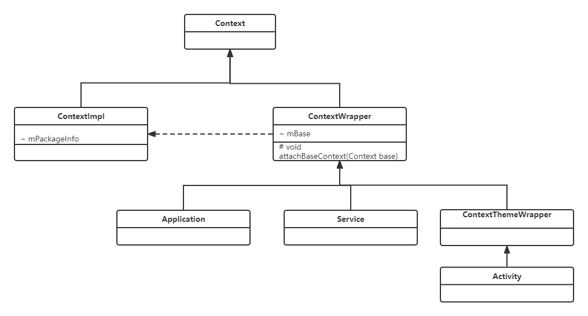

# Android Context 分析 

## 继承结构

ContextWrapper是上下文的包装类，ContextImpl是上下文的实现类，Activity是ContextThemeWrapper的直接子类。

## getApplicationContext都做了什么
翻看ContextWrapper源码:
```java
     public class ContextWrapper extends Context {
     
      Context mBase;

    public ContextWrapper(Context base) {
        mBase = base;
    }
    
    /**
     * Set the base context for this ContextWrapper.  All calls will then be
     * delegated to the base context.  Throws
     * IllegalStateException if a base context has already been set.
     * 
     * @param base The new base context for this wrapper.
     */
    protected void attachBaseContext(Context base) {
        if (mBase != null) {
            throw new IllegalStateException("Base context already set");
        }
        mBase = base;
    }

   @Override
    public Context getApplicationContext() {
        return mBase.getApplicationContext();
    }
    ....
     }
```
ContextWrapper的getApplicationContext方法直接调用mBase的getApplicationContext方法，mBase实际上是ContextImpl类实例，通过上面源码看到，在ContextWrapper类的attachBaseContext方法为其赋值。  
## 什么时候调用的Application的attachBaseContext方法？  
在ContextWrapper子类Application类的attach方法中：
```java
final void attach(Context context) {
        attachBaseContext(context);
        mLoadedApk = ContextImpl.getImpl(context).mPackageInfo;
    }
```
而Application的attach方法是在Instrumentation类的[newApplication](https://android.googlesource.com/platform/frameworks/base.git/+/master/core/java/android/app/Instrumentation.java)方法中调用.
```java
static public Application newApplication(Class<?> clazz, Context context)
            throws InstantiationException, IllegalAccessException, 
            ClassNotFoundException {
        Application app = (Application)clazz.newInstance();
        app.attach(context);
        return app;
    }
```
继续向上追溯，Instrumentation的newApplication方法是在LoadApk的[makeApplication](https://android.googlesource.com/platform/frameworks/base/+/master/core/java/android/app/LoadedApk.java#makeApplication)方法中调用：
```java
public Application makeApplication(boolean forceDefaultAppClass,
            Instrumentation instrumentation) {
        if (mApplication != null) {
            return mApplication;
        }
        Application app = null;
        String appClass = mApplicationInfo.className;
        if (forceDefaultAppClass || (appClass == null)) {
            appClass = "android.app.Application";
        }
        try {
            final java.lang.ClassLoader cl = getClassLoader();
            ...
            ContextImpl appContext = ContextImpl.createAppContext(mActivityThread, this);
      
            app = mActivityThread.mInstrumentation.newApplication(
                    cl, appClass, appContext);
            appContext.setOuterContext(app);
        } catch (Exception e) {
         ...
        }
        mActivityThread.mAllApplications.add(app);
        mApplication = app;
     ...
        return app;
    }
```
最终调用LoadApk的makeApplication方法的地方都在[ActivityThread](http://androidxref.com/7.1.2_r36/xref/frameworks/base/core/java/android/app/ActivityThread.java)的多个方法中：performLaunchActivity,handleReceiver,handleCreateService,handleBindApplication,attach.


