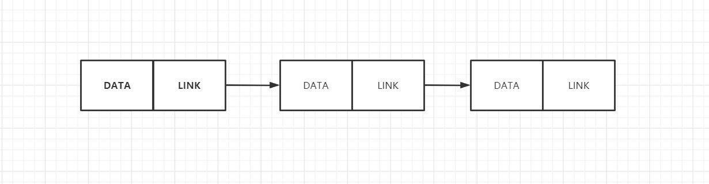

# 数据结构基础-链表（linked list）

​	**链表**在数据结构中通常用来实现其他的数据结构，它是一个节点序列，其中每个节点存储自己的数据和指向下一个节点位置的指针（地址），可以被想象成一个链接链：

 列表中最后一项有一个指向NULL的链接，表示链的结尾。

### 优点（与数组对比）

尽管链表有点像数组，但是它不限制声明元素的长度

数组需要把数据存储在连续的内存或者磁盘上，链表不需要

链表插入和移除元素更高效，不需要重新分配和组织整个，因为数据不需要连续存储

### 缺点

1. 不允许随机访问，访问数据必须第一个开始遍历，因为没法办用链表实现二分查找
2. 需要额外的内存空间指向链接

链表通常用作构建其他数据结构的基本模块，比如栈，队列，树，图。

### 链表的细分类型 

##### 单链表

链表中每个元素都指向下一个元素，最后一个元素指向空

##### 环形链表

链表中每个元素都指向下一个元素，最后一个元素指向第一个

##### 双向链表

链表中每个元素都指向下一个元素，也指向上一个元素，首个元素的向上指向空，最后一个元素向下指向空 

##### 双向环形链表

跟双向链表类似，但是首个元素向上指向最后一个，最后一个向下指向第一个 

### Java实现的简单的双向链表

~~~java
/**
 * java 实现双向链表demo
 */
public class DoubleLinkedList {

    class Node{
        Node prev;
        int data;
        Node next;

        public Node(int data) {
            this.data = data;
        }
    }
    Node head;
    Node tail;

    /**
     * 链表头部添加数据
     * @param data
     */
    void addHead(int data){
        Node addData=new Node(data);
        addData.prev=null;
        addData.next=head;
        if(head!=null){
            head.prev=addData; //只修改head的prev后续结构无需改变
            head=addData;
        }
        if(tail==null){
            tail=addData;
        }

    }

    /**
     * 链表尾部添加数据
     * @param data
     */
    void addTail(int data){
        Node tailData=new Node(data);
        tailData.prev=tail;
        tailData.next=null;
        if(tail!=null){
            tail.next=tailData;
            tail=tailData;
        }
        if(head==null){ //空链表
            head=tailData;
        }

    }

    /**
     * 在数据为key的节点后插入数据
     * @param key
     * @param data
     */
    void addAtKey(int key,int data){
        Node addData=new Node(data);
        Node current=head;
        while (current!=null&&current.data!=key){
            current=current.next;
        }
        if(current==null){ //没有定位到数据
            addData=null;
           return;
        }else{  //插入数据
            addData.next=current.next;
            current.next=addData;
            addData.prev=current;

        }
    }

    /**
     * 删除链表的第一个节点
     */
    void deleteHead(){
        if(head==null){ //head为空直接返回
            return;
        }else if(head.next==null){
            head=null;
        }else{
            head=head.next;
            head.prev=null;
        }

    }

    /**
     * 删除最后一个元素
     */
    void deleteTail(){
        if(head==null){
            return;
        }else if(head.next==null){ //只有一个节点
            head=null;
        }else{
            tail=tail.prev;
            tail.next=null;
        }

    }
}

~~~

