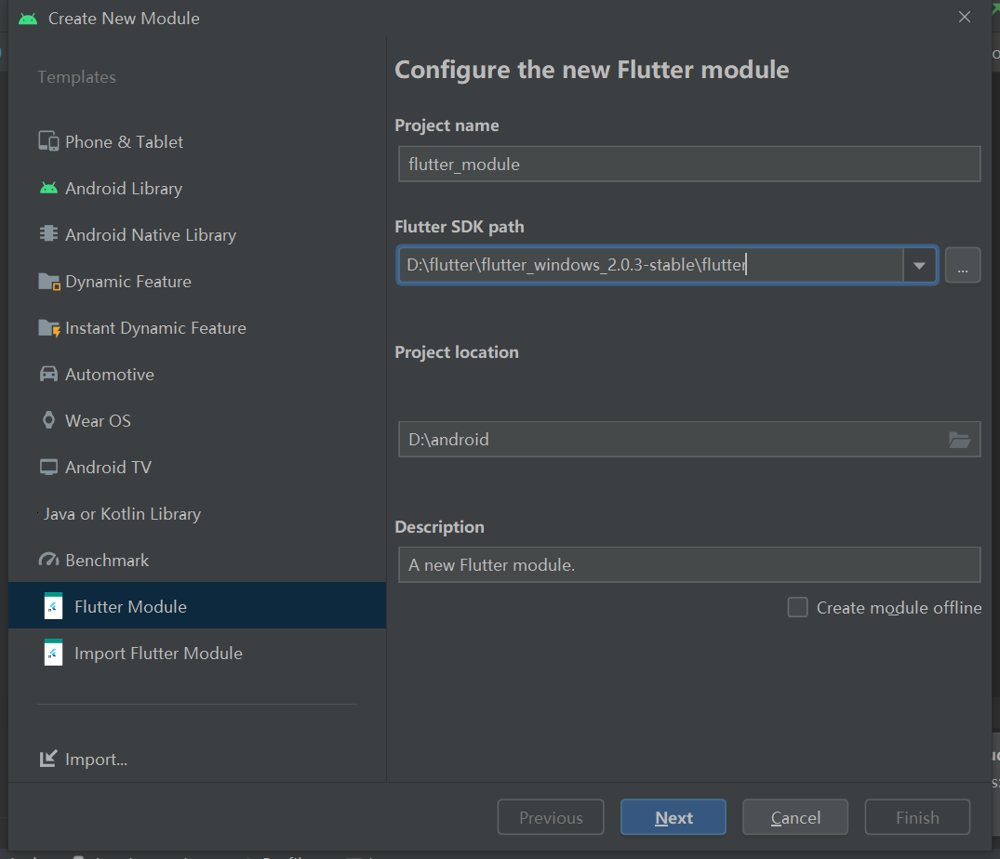

# Flutter 集成到现有的安卓原生项目中-集成方式

> Flutter可以作为Gradle子工程或AAR文件嵌入到现有的安卓原生项目中，集成流程可以使用Android Studio的插件或手动集成，从Flutter v1.26开始，支持在原生项目中集成多个Flutter引擎、screen，view的实例。

~~~
注意：你的原生安卓项目可能支持mips或x86架构，Flutter目前（2021年9月）只支持AOT模式编译x86_64,armabi-v7a,arm64-v8a
可以在app上使用abiFilters安卓Gradle插件api限制支持的架构，避免缺少libflutter.so造成的运行时异常，比如：
android {
  //...
  defaultConfig {
    ndk {
      // Filter for architectures supported by Flutter.
      abiFilters 'armeabi-v7a', 'arm64-v8a', 'x86_64'
    }
  }
}
Flutter引用有x86和x86——64版本，当使用模拟器JIT模式调试时，Flutter模块会正确的运行。
~~~

## 用Android Studio集成

Android Studio自动集成Flutter module是非常方便的，可以在项目中同时编辑android原生代码和Flutter代码，并可以继续使用Flutter插件，比如Dart代码自动补全，hot reload，widget检查等。

添加到app的流程支持Android Studio 3.6，42+的IntelliJ Flutter插件，Android Studio集成也只支持使用源码gradle子项目集成，而不支持使用AAR.

使用Android Studio菜单栏的**File>New>New Module...**，你可以创建一个新的Flutter module集成，或者选择一个之前创建的Flutter module

Android Studio插件会自动配置Android工程，添加Flutter module作为依赖。

------

## 手动集成

手动集成Flutter module到安卓项目，不使用Android studio插件，按照如下步骤：

#### 创建一个Module

假设我们有一个Android app在 **some/path/MyApp** 路径，我们想要我们的Flutter 工程在同级目录

~~~
cd some/path/
flutter create -t module --org com.adamin flutter_m3
~~~

这样会在**some/path/flutter_m3**目录下创建一个Flutter module，里面有一些Dart代码作为你的初始代码，还有个**.android**的隐藏文件夹，**.android**文件夹包含一个android项目，它既可以帮助你通过**flutter run**命令单独运行flutter模块，也是一个包装器，可以帮助将Flutter模块引导为可嵌入的android 库。

#### Java 8 需求

Flutter Android 引擎使用Java 8特性。在尝试连接Flutter module到宿主安卓app之前，确保宿主Android app **build.gradle**文件下**android  {}**模块下声明了源码兼容如下：

~~~
android {
  //...
  compileOptions {
    sourceCompatibility 1.8
    targetCompatibility 1.8
  }
}

~~~

####  添加Flutter module作为依赖 

现在我们在Gradle里添加Flutter module作为宿主app的依赖，有两种发方式可以实现。AAR机制通过创建通用的Android AAR作为媒介来打包您的Flutter module，当您的下游应用程序构建者不想安装Flutter SDK时这样很好。但是如果你经常构架，它会增加一个构建步骤。

源码子项目机制是一个很方面的一键构建方式，但是依赖Flutter SDK,这种机制被Android Studio插件使用。

##### 方式1 - 依赖Android 存档（AAR）

这种方式把你的Flutter

依赖打包成一个通用的本地Maven仓库，由AAR和POM工件组成，可以使你的团队人员不用安装Flutter SDK构建宿主app，你可以从本地或原生仓库分发工件。

构建命令如下：

~~~
cd /some/path/flutter_m3
flutter build aar
~~~

然后按照终端上输出的指令集成。

这一步可能会报错，报错信息如下：

~~~
Exception in thread "main" java.util.zip.ZipException: zip END header not found
        at java.base/java.util.zip.ZipFile$Source.zerror(ZipFile.java:1581)
        at java.base/java.util.zip.ZipFile$Source.findEND(ZipFile.java:1476)
        at java.base/java.util.zip.ZipFile$Source.initCEN(ZipFile.java:1483)
        at java.base/java.util.zip.ZipFile$Source.<init>(ZipFile.java:1288)
        at java.base/java.util.zip.ZipFile$Source.get(ZipFile.java:1251)
        at java.base/java.util.zip.ZipFile$CleanableResource.<init>(ZipFile.java:732)
        at java.base/java.util.zip.ZipFile$CleanableResource.get(ZipFile.java:849)
        at java.base/java.util.zip.ZipFile.<init>(ZipFile.java:247)
        at java.base/java.util.zip.ZipFile.<init>(ZipFile.java:177)
        at java.base/java.util.zip.ZipFile.<init>(ZipFile.java:191)
        at org.gradle.wrapper.Install.unzip(Install.java:214)
        at org.gradle.wrapper.Install.access$600(Install.java:27)
        at org.gradle.wrapper.Install$1.call(Install.java:74)
        at org.gradle.wrapper.Install$1.call(Install.java:48)
        at org.gradle.wrapper.ExclusiveFileAccessManager.access(ExclusiveFileAccessManager.java:65)
        at org.gradle.wrapper.Install.createDist(Install.java:48)
        at org.gradle.wrapper.WrapperExecutor.execute(WrapperExecutor.java:128)
        at org.gradle.wrapper.GradleWrapperMain.main(GradleWrapperMain.java:61)

Gradle task assembleAarDebug failed with exit code 1.
~~~

这个时候我们需要进入在目录下输入`gradlew.bat`指令排查安卓构建问题，会发现是gradle文件解压失败导致的，我们删除`C:\Users\用户名\.gradle\wrapper\dists\gradle-6.7-all`目录下的所有文件，在执行`gradlew.bat`,会自动下载gradle并解压构建。终端最后两行输出下面信息就代表构建成功了。

~~~

BUILD SUCCESSFUL in 1m 25s
1 actionable task: 1 executed
~~~

接下来我们继续执行`flutter build aar`指令，终端上会输出下面信息：

~~~
D:\android\nettyAndroidDemo\flutter_m3\.android>flutter build aar
Changing current working directory to: D:\android\nettyAndroidDemo\flutter_m3

Building without sound null safety
For more information see https://dart.dev/null-safety/unsound-null-safety

Running Gradle task 'assembleAarDebug'...
Running Gradle task 'assembleAarDebug'... Done                     34.3s
√ Built build\host\outputs\repo.
Running Gradle task 'assembleAarProfile'...
Running Gradle task 'assembleAarProfile'... Done                   38.3s
√ Built build\host\outputs\repo.
Running Gradle task 'assembleAarRelease'...
Running Gradle task 'assembleAarRelease'... Done                   32.5s
√ Built build\host\outputs\repo.

Consuming the Module
  1. Open <host>\app\build.gradle
  2. Ensure you have the repositories configured, otherwise add them:

      String storageUrl = System.env.FLUTTER_STORAGE_BASE_URL ?: "https://storage.googleapis.com"
      repositories {
        maven {
            url 'D:\android\nettyAndroidDemo\flutter_m3\build\host\outputs\repo'
        }
        maven {
            url "$storageUrl/download.flutter.io"
        }
      }

  3. Make the host app depend on the Flutter module:

    dependencies {
      debugImplementation 'com.adamin.flutter_m3:flutter_debug:1.0'
      profileImplementation 'com.adamin.flutter_m3:flutter_profile:1.0'
      releaseImplementation 'com.adamin.flutter_m3:flutter_release:1.0'
    }

  4. Add the `profile` build type:

    android {
      buildTypes {
        profile {
          initWith debug
        }
      }
    }

To learn more, visit https://flutter.dev/go/build-aar
~~~

接下来我们要使用aar的话，就按照上面终端输出的四步去配置gradle：

1. 打开宿主app的build.gradle

2. 配置本地仓库

   ~~~
   String storageUrl = System.env.FLUTTER_STORAGE_BASE_URL ?: "https://storage.googleapis.com"
         repositories {
           maven {
               url 'D:\android\nettyAndroidDemo\flutter_m3\build\host\outputs\repo'
           }
           maven {
               url "$storageUrl/download.flutter.io"
           }
         }
   ~~~

   3. 添加依赖 

      ~~~
       dependencies {
            debugImplementation 'com.adamin.flutter_m3:flutter_debug:1.0'
            profileImplementation 'com.adamin.flutter_m3:flutter_profile:1.0'
            releaseImplementation 'com.adamin.flutter_m3:flutter_release:1.0'
          }
      ~~~

   4. 添加profile构建类型

      ~~~
       android {
            buildTypes {
              profile {
                initWith debug
              }
            }
          }
      ~~~

   ##### 方式2，依赖flutter模块源码 

   在宿主安卓app的**settings.gradle**文件里包含flutter module：

   ~~~90
   // Include the host app project.
   include ':app'                                    // assumed existing content
   setBinding(new Binding([gradle: this]))                                // new
   evaluate(new File(                                                     // new
     settingsDir.parentFile,    //这里如果flutter模块在宿主app目录的根目录下的话，去掉.parentFile                                         // new
     'my_flutter/.android/include_flutter.groovy'                         // new
   ))                                                                     // new
   
   ~~~

   这里的binding和evaluate允许Flutter模块在settings.gradle评估的上下文钟包含自身

（:flutter）和flutter模块依赖的插件。

在宿主app的**build.gradle**添加flutter模块依赖 ：

~~~
dependencies {
  implementation project(':flutter')
}

~~~

这样就在安卓原生项目中手动集成了flutter。

## 总结

安卓原生项目集成flutter由两种方式：

1. Android Studio菜单集成**File>New>Module**创建或选择Flutter module，Android Studio会自动配置和依赖模块
2. 手动集成
   - 执行`flutter create -t module --org com.adamin module_name`创建模块
   - 依赖集成方式有两种，aar或源码依赖方式。
