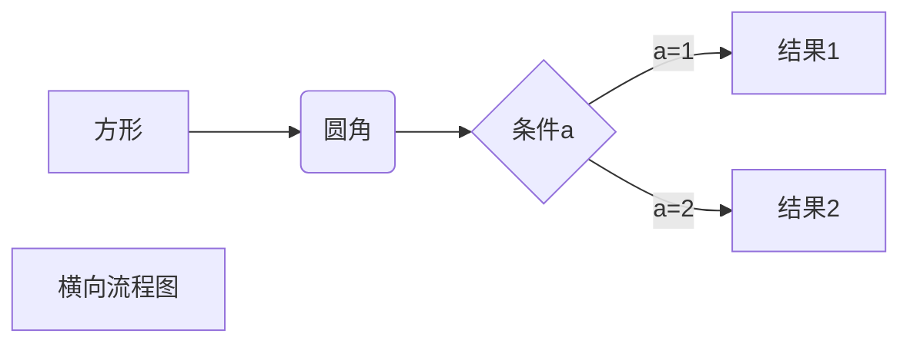
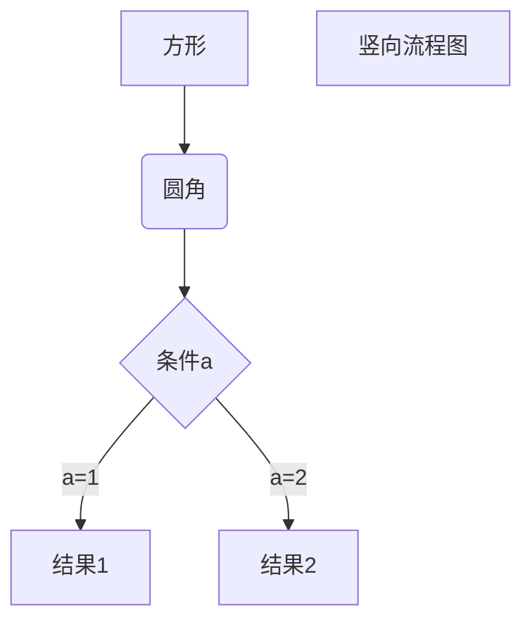
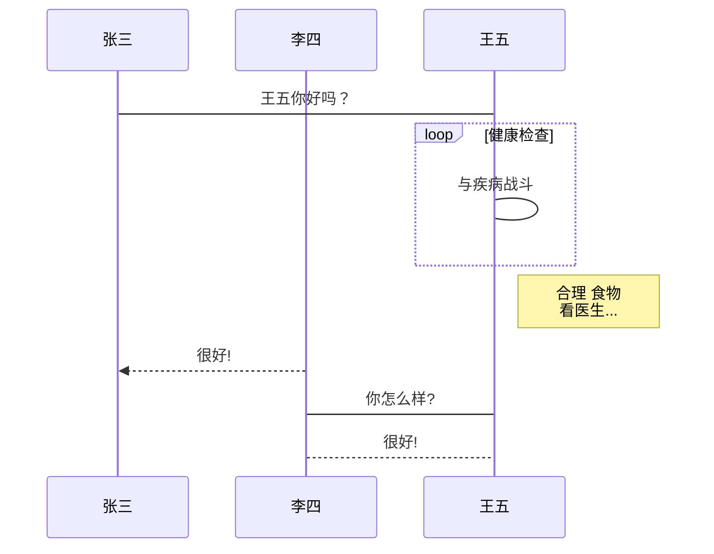
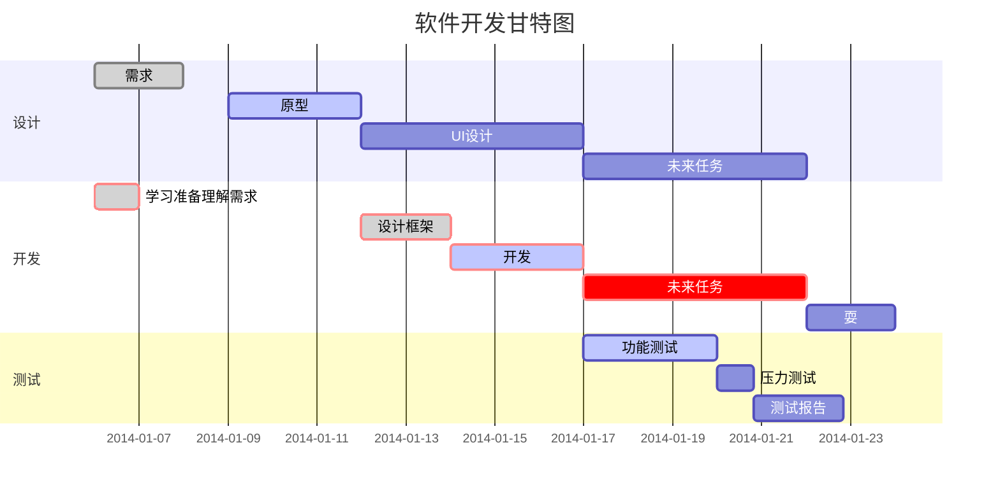

一至六级标题分别对应一到六个#，然后加一个空格，举例

```bash
# 一级标题
## 二级标题
### 三级标题
#### 四级标题
##### 五级标题
###### 六级标题
```

效果如下：

# 一级标题
## 二级标题
### 三级标题
#### 四级标题
##### 五级标题
###### 六级标题  


文字加粗，要加粗的文字左右两边加两个*，不能带空改 ：

~~~bash
**加粗文字**
~~~

效果 **加粗文字**

文字斜体，文字左右两边加1个*，不能带空改：

~~~bash
*斜体*
~~~

效果 *斜体文字*

文字加粗并斜体，文字左右两边加3个*，不能带空改：

~~~bash
***加粗斜体***
~~~

效果 ***加粗斜体***

文字加删除线，文字左右两边加2个~

~~~bash
~~删除线~~
~~~

效果 ~~删除线~~

文字加粗删除线，套娃，两个~两个*中间加文字

~~~
~~**加粗删除线**~~
~~~

效果，~~**加粗删除线**~~

文字加粗斜体删除线，套娃，两个~三个*中间加文字

~~~
~~***加粗斜体删除线***~~
~~~

效果 ~~***加粗斜体删除线***~~

斜体删除线，套娃，两个~1个*中间加文字

~~~
~~*斜体删除线*~~
~~~

效果 ~~*斜体删除线*~~

引用，另起一行， 加>，后面加空改，跟文字

~~~
> 引用数据
~~~

效果  

> 引用数据

分割线 ，三个以上-或*

~~~
---
***
----
等
~~~


效果 

---

***

----

图片

~~~

~~~

效果   


超链接

~~~
[链接名](链接地址)
~~~

效果 [Adamin](https://www.lixiaopeng.top)

无须列表 

~~~
- 列表内容
+ 列表内容
* 列表内容

-，+或*后面要加空改,
~~~

效果：

- column1
- column2

有序列表 

~~~
1. 内容
2. 内容2
数字表示，后面到有空改
~~~

效果

1. 列表1
2. ~~列表2~~
3. **列表3**

多级列表（嵌套），在列表后另起一行再使用有序或者无需列表

~~~
1. 父标题
    - 子标题
    - 子标题2
2. 父标题2
~~~

效果

1.  父标题
   - 子标题
   - 子标题2
2. 父标题2
3. 父标题3

代码，代码块 

~~~
使用 ` 反引号前后闭合包住一个函数或代码片段
`echo "hello world"; `
使用4个空格或一个制表符（tab）表示代码区块 
使用三个~，包裹一段代码可以指定代码的语言 
~~~

三种效果 

`echo "hello world!"; `

​    <?php echo 'hellow'; ?>

~~~java
System.out.println("hello world");
~~~

表格

~~~
| 表头 | 表头 |
| ---- | ---- |
| 单元格|单元格 |
:- 左对齐
-： 右对齐
:-: 居中 
~~~

效果

| 左对齐表头 | 居中对齐表头 | 右对齐表头 |
| :--------- | :----------: | ---------: |
| 左         |      中      |         右 |

流程图，甘特图

~~~

横向流程图源码格式：



竖向流程图源码格式：



标准流程图源码格式：

```flow
st=>start: 开始框
op=>operation: 处理框
cond=>condition: 判断框(是或否?)
sub1=>subroutine: 子流程
io=>inputoutput: 输入输出框
e=>end: 结束框
st->op->cond
cond(yes)->io->e
cond(no)->sub1(right)->op
```

标准流程图源码格式（横向）：

```flow
st=>start: 开始框
op=>operation: 处理框
cond=>condition: 判断框(是或否?)
sub1=>subroutine: 子流程
io=>inputoutput: 输入输出框
e=>end: 结束框
st(right)->op(right)->cond
cond(yes)->io(bottom)->e
cond(no)->sub1(right)->op
```

UML时序图源码样例：

```sequence
对象A->对象B: 对象B你好吗?（请求）
Note right of 对象B: 对象B的描述
Note left of 对象A: 对象A的描述(提示)
对象B-->对象A: 我很好(响应)
对象A->对象B: 你真的好吗？
```

UML时序图源码复杂样例：

```sequence
Title: 标题：复杂使用
对象A->对象B: 对象B你好吗?（请求）
Note right of 对象B: 对象B的描述
Note left of 对象A: 对象A的描述(提示)
对象B-->对象A: 我很好(响应)
对象B->小三: 你好吗
小三-->>对象A: 对象B找我了
对象A->对象B: 你真的好吗？
Note over 小三,对象B: 我们是朋友
participant C
Note right of C: 没人陪我玩
```

UML标准时序图样例：



甘特图样例：


~~~


