# UML Class Diagram 
# UML 类图  
------
The UML diagram is a graphical notation used to construct and visualize object oriented systems. A class diagram in the Unified Modeling Language is a type of static structure diagram that describes the structure of a system by showing the system's :  
UML类图是一种构造和可视化面向对象系统的图形符号。一个统一模型语言（UML）中的类图是一直静态结构化图形，它通过展示以下内容描述了系统的结构：
- classes 类
- their attributes 属性
- operations(or methods) 操作（方法）
- and the relationships among objects 和对象之间的关系   
## What is a Class ? 什么是类  
A class is a blueprint for an object. Objects and classes go hand in hand. We can't talk about one without talking about the other. And the entire point of Object-Oriented Design is not about objects,it's about classes,because we use classes to create objects. So a class describles what an object will be,but it isn't the object itself.   
一个类是是对象的蓝图，对象和类结伴而行。我们无法在没有任何其一的情况下讨论其中一个。并且面向对象设计的关注点不是关于对象，而是关于类，因为我们使用类创建对象。所以一个类描述了一个对象将要是什么，单是它并不是对象本身。  
In fact,classes describe the type of objects,while objects are usable instances of classes. Each Object was build from the same set of blueprints and therefore contains the same components(properties and methods). The standart meaning is that an object is an instance of a class and object - Objects have states and behaviors.  
事实上，类描述了对象的类型，对象是类可用的实例。每个对象都是从同一个系列蓝图构建的，因此包含了相同的组件（属性和方法）。标准意思就是一个对象是类的实例，对象拥有状态和表现。  
## UML Class Notation UML类符号
A class represent a concept which encapsluates state(attributes) and behavior (operations).Each attribute has a type.Each operation has a signature.The class name is the only mandatory information.  
一个类代表了一个封装了状态（属性）和表现（操作）的概念。每个属性都有一个类型，每个操作都有一个签名。类名是唯一的强制信息。  
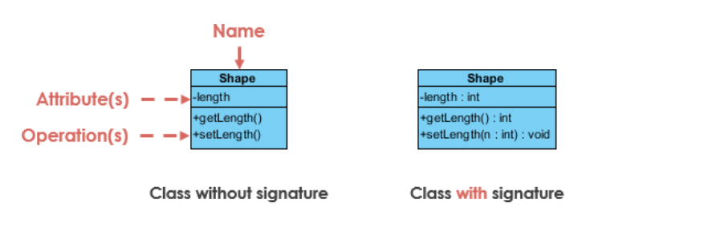  
#### Class Name:
#### 类名：
- The name of the class appears in the first partition. 
- 显示在第一部分的类的名称。  
#### Class Attributes:  
#### 类属性:
- Attributes  are shown in the second partition. 属性在第二部分显示  
- The attributes type is shown after the colon. 属性的类型在冒号后面  
- Attributes map onto member variables(data members) in code. 属性映射代码中的成员变量(数据变量)。  

#### Class Operations(Methods):
#### 类操作（方法）:  
- Operations are shown in the third partition.They are services the class provides. 操作展示在第三部分，它们是类提供的服务。  
- The return type of a method is shown after the colon at the end of the method signature.  返回类型在方法签名后的冒号后面显示。  
- The return type of method parameters are shown after the colon following the parameter name. Operations map onto class methods in code. 返回类型的方法参数在参数名后的冒号后面，操作映射了代码中的类方法。   
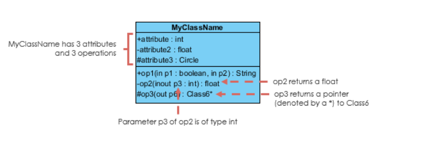  
上图展示了类MyClassName有3个属性和三个操作  
#### Class Visibility 类可见性  
The +,- and # symbols before and attribute and operation name in a class denote the visibility of the attribute and operation.  
+,-,#符号防止在属性和方法的前面指明了属性和方法的可见性。  
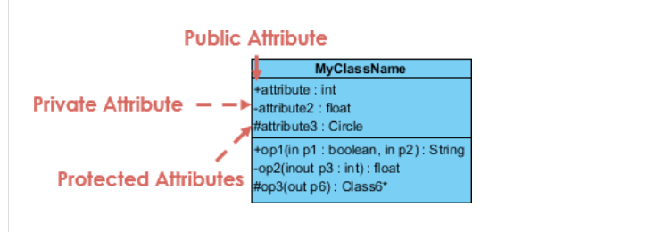  
- + denotes public attributes or operations +号表明public属性或方法  
- - denotes private attributes or operations -号表明private属性或方法   
- **#** denotes protected attributes or operations #标识protected 属性或方法 
- ~ 标识包访问级别的属性或方法  
## Perspectives of Class Diagram  类图的视角   
The choice of perspective depends on how far along you are in the development process.During the formulation of a **domain model**,for example,you would seldom move past the **conteptual perspective**.
**Analysis models** will typically feature a mix of **conceptual and specification perspectives**. **Design model** development will typically start with heavy emphasis on the **specification perspective**,and evolve into the **implementation perspective**.  
视角的选择取决于开发的进度。在**领域模型**的建立期间，比如，你很少超越**概念视角**。**分析模型**会典型的以混合的**概念和规则视角**为特点。**设计模型**开发会典型的以大量的强调**规则视角**开始，并且演化成**实现视角**。 
A diagram can be interpreted from various perspectives:  
一个图可以从不同的视角解释：  
- **Conceptual**: represents the concepts in the domain. **概念**:代表领域中的概念
- **Specification**: focus is on the interfaces of Abstract Data Type(ADTs) in the software. **规则**：,关注的软件中抽象数据类型的接口  
- **Implementation**: describes how classes will implement their interfaces. **实现**:描述了类如何实现它们的接口  
The perspective affects the amount of detail to be supplied and the kinds of relationships worth presenting.as we mentioned above,the class name is the only mandatory information.  
视角影响了详细应用的数量和关系展示的种类。
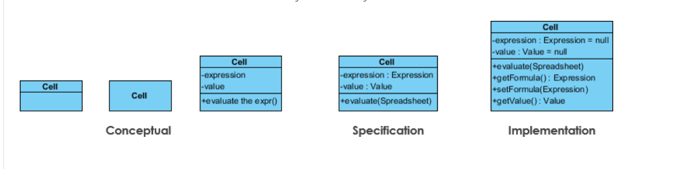  
## Relationships between classes 类之间的关系  
UML is not just about pretty pictures. If used correctly,UML precisely conveys how code should be implemented from diagrams. If precisely interpreted, the implemented code will correctly reflect the intent of the designer. Can you describe what each of the relationships mean relative to your target programming language shown in the Figure below ?  
UML不要仅仅是关于好看的图片的。如果使用正确，UML会从图上明确的表达代码应该如何实现。如果按照UML精确的解释了，实现代码会正确的映射设计者的意图。你能买哦书每个关系相对于目标编程语言的含义吗？  
If you can't recognize them,no problem this section is meant to help you to understand UML class relationships. A class may by involved in one or more relationships with other classes. A relationship can be one of the following types.   
一个类可能与其他类有一个或多个关系，关系可以是下面这些类型：  
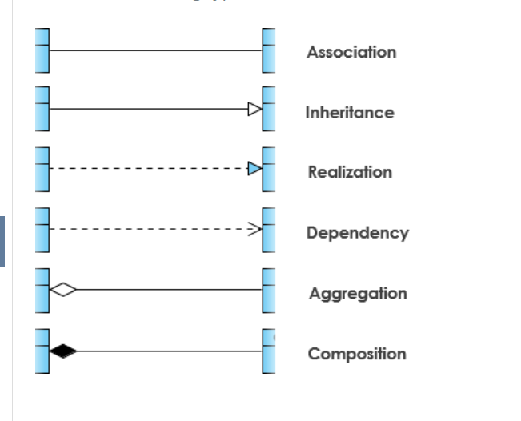  
#### Inheritance(or Generalization) 继承（泛化）  
A generalization is a taxonomic relationship between a more general classifier and a more specific classifier. Each instance of the specific classifier is also an indirect instance of the general classifier. Thus,the specific classifier inherits the features of the more general classifier.   
泛化是一个更加通用分类器和更加具体分类器之间的分类化关系。每个具体分类器的实例也是一个通用分类器的非直接实例。因此，具体分类器继承了更通用分类器的特性。  
- Represents an "is-a" relationship. 代表一个“is-a”的关系。  
- An abstract class name is shown in italics 抽象类名称用斜体显示  
- SubClass1 and SubClass2 are specializations of SuperClass. 子类是特别的父类  
The figure below shows an example of inheritance hierachy. SubClass1 and SubClass2 are derived from SuperClass. The relationship is displayed as a solid line with a hollow arrowhead that points form the child element to the parent element.  
下图展示了一个继承结构的例子，SubClass1和SubClass2派生自SuperClass.这种关系的展示是由一条实线和一个空心的箭头组成，由子元素指向父元素。  
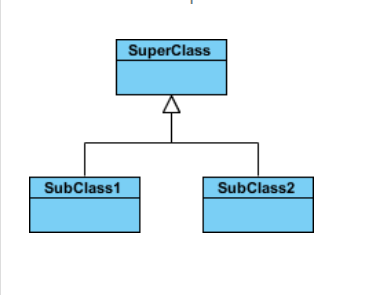  
#### Inheritance Example - Shapes 继承例子 -形状  
The figure below shows an inheritance example with two stypes. Although the connectors are drawn differently ,they are semantically equivalent. 
下图通过两种类型方式展示了一个继承的例子，尽管连线划线方式不同，它们语义上是相等的。  
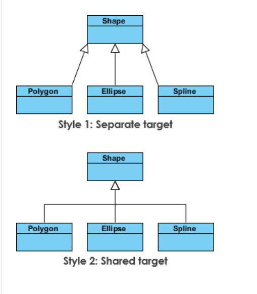   
#### Association 关联关系  
Associations are relationships between class in a UML Class Diagram. They are represented by a solid line between classes. Associations are typically named using a verb or verb phrase which reflects the real world problem domain.  
关联关系是类图中两个类的一种关系，它们通过一条类之间的实线表示。关联关系典型的会以动词或动词短语命名，以表示真是世界的问题领域。  
#### Simple Association 简单关联  
- A structural link between two peer classes 两个同伴类之间的结构化链接  
- The is an association between Class1 and Class2 两个类之间有关联  
The figure below shows an example of simple association. There is an association that connects the <<control>> class Class1 and <<boundary>> class Class2. The relationship is displayed as a solid line connecting the two classes.  
下图展示了简单关联的例子，有一个关联连接了控制类Class1和边界类Class2,关系用一个连接两个类的实线展示。  
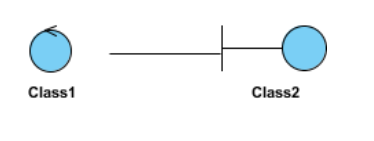  
#### Cardinality 基数  
Cardinality is expressed in terms of :  
基数用下面属于表达：  
- one to one 一对一 
- one to many 一对多 
- many to many 多对多  

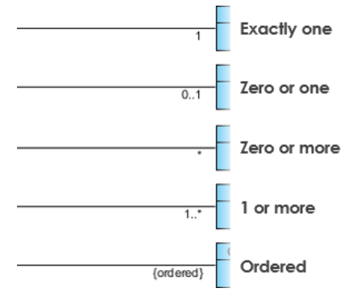  
#### Aggregation 聚合关系 
A special type of association. 一种特殊的关联关系。  
- It represents a "part of" relationship 表示一种“部分”的关系  
- Class2 is part of Class1 Class2是Class1的一部分  
- Many instances(denoted by the *) of Class2 can be associated with Class1 多个Class2的实例（*指明）可以与Class1关联  
- Objects of Class2 and Class1 have separate lifetimes Class1和Class2的对象拥有分离的生命时长  
The figure below shows an example of aggregation. The relationship is displayed as a solid line with a unfilled diamond at the association end,which is connected to the class that represents the aggregate.  
下图展示了一个聚合的例子，关系的展示由一条实线和非填充的棱形连接到关系结尾组成。  
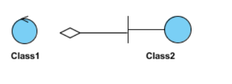  
#### Composition 组合 
- A special type of aggregation where parts are destroyed when the whole is destroyed. 组合是一种特别的聚合，部分随着整体的销毁而销毁  
- Objects of Class2 live and die with Class1 Class2的对象随着Class1生存和死亡  
- Class2 cannot stand by itself Class2不能独立存在  
The figure below shows an example of composition. The relationship is displayed as a solid line with a filled diamond at the association end,Which is connected to the class that represents the whole or composite.  
下图展示了组合的一个例子，关系的展示由一条实线和一个实心的棱形连接关系的结尾组成。  
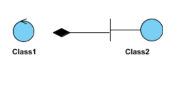  
#### Dependency 依赖  
An object of one class might use an object of another class in the code of a method. If the object is not stored in any field,then this is modeled as a dependency relationship.  
一个类的对象可能在方法代码里面使用另一个类的对象，如果这个对象没有被存储在任何字段里面，那么这被建模为一种依赖关系  
- A special type of association 一种特殊的关联关系　　
- Exists between two classes if changes to the definition of one may cause changes to the other(but not the other way around) 如果修改两个类中的一个定义可能引起另一个的改变　　
- Class1 depends on Class2  Class1依赖Class2  
The figure below shows an example of dependency. the relationship is deplayed as a dashed line with an open arrow .  
下图是一个依赖的实例，它们的关系由一条虚线和一个开箭头表示。　　
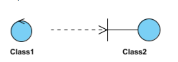  
The figure below shows another example of dependency.The Person class might have a hasRead method with a book parameter that return true if the person has read the book(perhaps by checking some database).  
下图展示了另一个依赖的实例，Person类可能有一个hasRead方法，用Book作为参数，如果person读过了书就返回true  
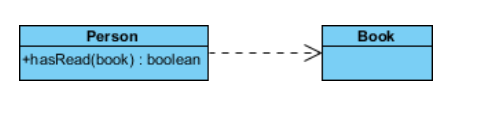  
#### Realization 实现　　
Realization is an relationship between the blueprint class and the object containing its respective implementation level details. This object is said to realize the blueprint class.In other words,you can understand this as the relationship between the interface and the implementing class .  
实现关系是蓝图类和包含各自实现级别细节对象的关系，这个对象是说实现了蓝图类。换句话说我们可以知道这是一个接口和实现类之间的关系。　　
For example, the Owner interface might specify methods for acquiring property and disposing of property. The Person and Corporation classes need to implement these methods,possibly in very different ways.  
举个例子，Owner接口可能定义了获取和处理属性的方法，Person和Corporation类需要实现这些方法，可能通过非常不同的方法。　　
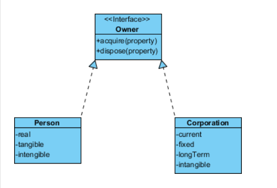  

## Class Diagram Example:Order System 
## 类图实例：订单系统  
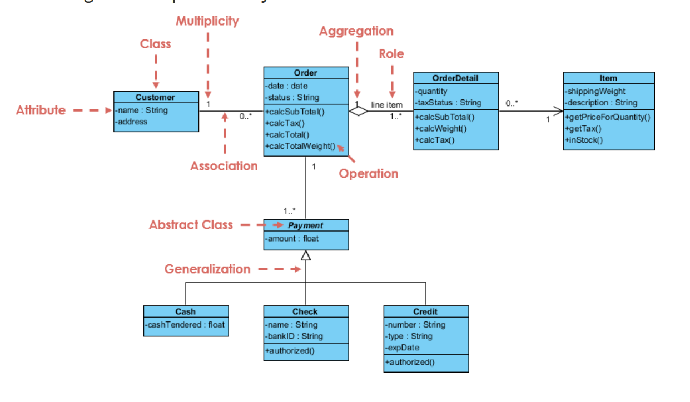  
## Class Diagram Example:GUI 
A class diagram may also have notes attached to classes or relationships.  
类图可以有附加在类或关系上的注释。  
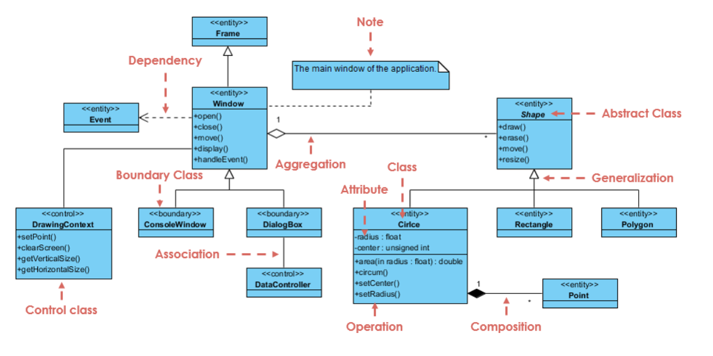  

## Related link 

[uml class diagram tutorial](https://www.visual-paradigm.com/guide/uml-unified-modeling-language/uml-class-diagram-tutorial/)

